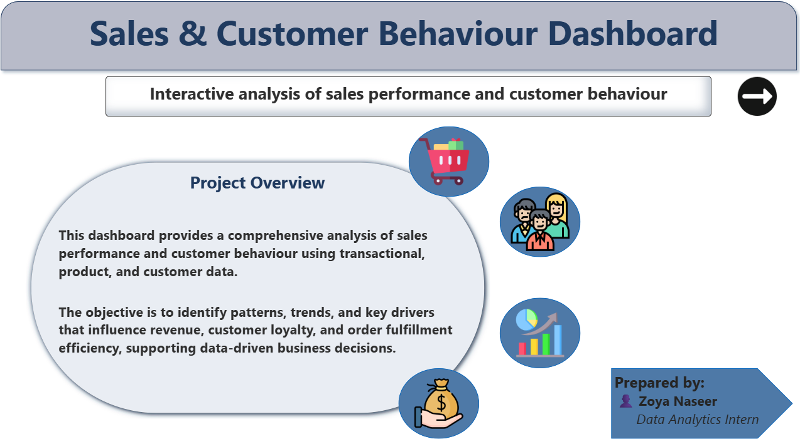
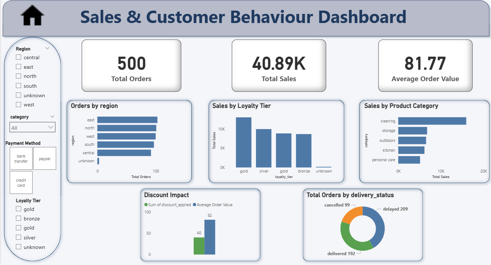

# 📊 Task: Sales & Customer Behaviour Data Visualization (Power BI)

## 📌 Project Overview
This project focuses on transforming raw sales, customer, and product data into an interactive **Power BI dashboard** to analyze business performance and customer behaviour.

The dashboard provides actionable insights into sales trends, customer loyalty, product performance, and regional distribution to support data-driven decision-making.

This task was completed as part of the **CodeAlpha Data Analytics Internship**.

---

## 📂 Datasets Used
Three CSV files were used in this project:

### 1️⃣ Sales Data (`sales_data.csv`)
- Order ID  
- Order Date  
- Sales Amount  
- Discount  
- Payment Method  
- Delivery Status  
- Region  

### 2️⃣ Customer Data (`customer_data.csv`)
- Customer ID  
- Loyalty Tier  
- Signup Date  
- Customer Demographics  

### 3️⃣ Product Information (`product_info.csv`)
- Product ID  
- Product Category  
- Product Name  
- Price  
- Product Attributes  

All datasets were cleaned, transformed, and connected using relationships in Power BI.

---

## 🛠 Tools & Technologies
- **Power BI Desktop**  
- **Power Query** for data cleaning and transformation  
- **DAX** for calculated measures and KPIs  
- **CSV files** as data sources  

---

## 📄 Dashboard Pages

### 🔹 Page 1: Introduction
- Dashboard objective and scope  
- Summary of sales and customer behaviour analysis  
- Clean and professional layout with icons representing:
  - Sales  
  - Customers  
  - Products  
  - Business Growth  

📷 **Introduction Page Preview**

---

### 🔹 Page 2: Sales & Customer Behaviour Dashboard
The interactive dashboard includes:

#### 📌 KPI Cards
- Total Sales  
- Total Orders  
- Average Order Value  

#### 📊 Visual Insights
- Sales by Region  
- Sales by Product Category  
- Orders by Loyalty Tier  
- Discount Impact on Sales  
- Order Status Distribution  

#### 🎛 Interactive Filters
- Region  
- Product Category  
- Payment Method  
- Loyalty Tier  

📷 **Dashboard Page Preview**

---

## 📊 Key Insights
- Regional sales performance varies significantly  
- Loyal customers contribute higher revenue  
- Certain product categories drive maximum sales  
- Discounts influence average order value  
- Delivery status impacts customer experience  

---

## 🎯 Outcome
This project demonstrates:
- End-to-end data visualization workflow  
- Strong Power BI dashboard design skills  
- Business-oriented data storytelling  
- Ability to work with multiple datasets and relationships  

---

## 👩‍💼 Prepared By
**Zoya Naseer**  
Data Analytics Intern  

---

## 🔗 Internship Task
**CodeAlpha – Data Analytics Internship**  
Task 3: Data Visualization using Power BI
